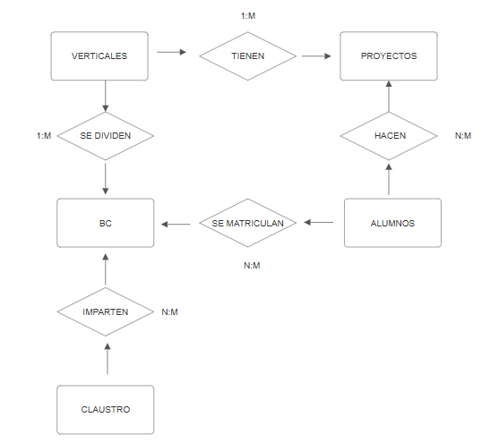

# Creación de BB.DD Académica

Este proyecto tiene como objetivo crear una base de datos enfocada en la gestión de información de estudiantes y profesores de una institución académica especializada en programas de entrenamiento intensivo en diversas áreas tecnológicas. 

El diseño está optimizado para realizar consultas eficientes y garantizar la integridad de los datos.

---

## 📂 Estructura de la Base de Datos

La base de datos contiene las siguientes tablas principales:

1. **Alumnos**
2. **Proyectos**
3. **Verticales**
4. **Calificaciones**
5. **Modalidad**
6. **Campus**
7. **Claustro**
8. **Bootcamp**
9. **A_Clase**
10. **P_Clase**

> 
---

## 🛠️ Herramientas Utilizadas

- **Sistema Gestor de Base de Datos (SGBD):** PostgreSQL
- **Librerías:**  
  - `pandas`  
  - `psycopg2`
  -  `sqlalchemy`
     
- **Archivos CSV:** Proporcionados para poblar las tablas con datos iniciales.  
- **Lenguaje de Programación:** Python, utilizado para interactuar con la base de datos y realizar operaciones.

---

## ⚙️ Configuración

### 1. Clonar este repositorio
```bash
git clone <https://github.com/IreneAP19/DDBB/blob/main/README.md>


